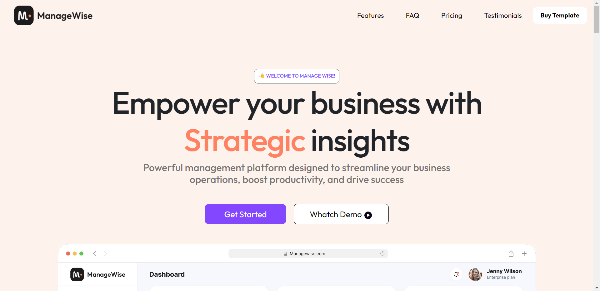

<div align="center">

<h4>The ManageWise Home Page</h4>
<br>

[](https://html.com/ "HTML")


[](https://code.visualstudio.com/ "Visual Studio Code")

<h3>The ManageWise Home Page: Design and Build a  Website</h3>
</div>

---

<br>

## About

Our Frontend Website is designed to give beautiful UI , with featuers such as our Nav section, main section and Attractive UI.Build with HTML , CSS and Bootstrap, Our Website is Userfriendly and Responsive in all device.

## Output



### Live at

https://raviraj-manage-wise-clone.netlify.app/

## Technology Stack

- HTML , CSS and Bootstrap
## To Run the Project

```sh
$ git clone https://github.com/Raviraj39/Managerwise
$ cd Managerwise
$ run the live server
Runs the app in the development mode.\
Open [http://localhost:5000](http://localhost:5000) to view it in the browser.
```

## Learn More

You can learn more in the https://getbootstrap.com/


### Show some :heart: and star the repo to support the project